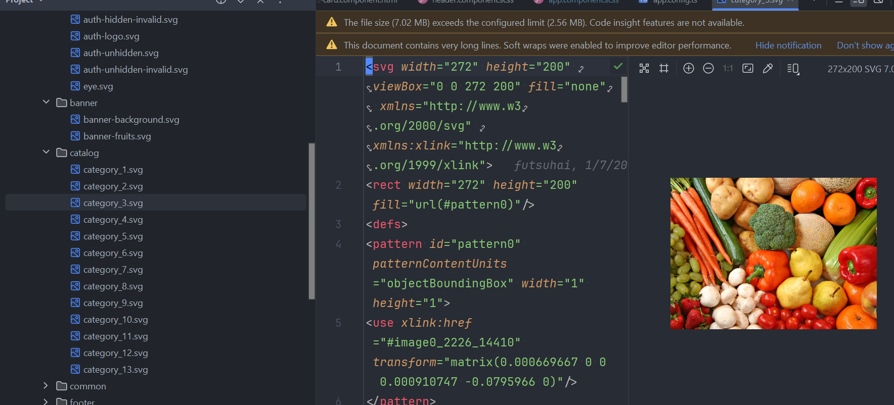
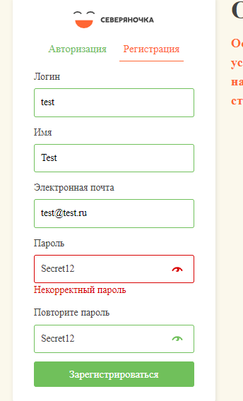

1. Это как раз пример того, когда svg юзать не надо.
   "_SVG идеально подходит для иконок, логотипов и любой графики, которая должна масштабироваться без потери качества.
   Однако для сложных изображений, таких как фотографии, SVG неэффективен. Фотографии лучше сохранять в растровых
   форматах, таких как JPEG, PNG или WebP, так как они лучше справляются с детализацией и цветовым
   балансом_.". Так же svg для больших картинок может огромную нагрузку на браузер делать (особенно на
   мобилках). В общем svg хорош для иконок, лого и всего что должно масштабироваться 
2. Вижу есть адаптивность - это круто. Не совсем идеально, но довольно хорошо. Молодец
3. Вот тут лучше сказать почему пароль некорректный и какой должен быть, это непосредственно влияет на
   UX 
4. После регистрации обычно сразу авторизируют юзера, это удобно
5. Корзина не работает. Нажимаю добавить в корзину, а товар там не появляется (Важно)
6. Советую шрифт поменять. Можно взять вот тут https://fonts.google.com/ например
